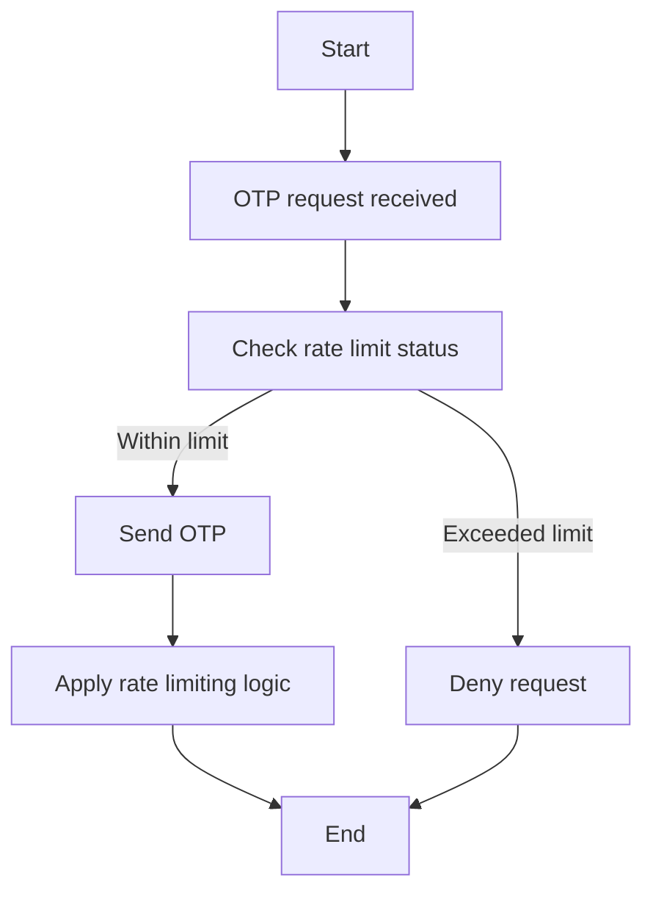

# 🛡️ Laporan Ringkas Analisis Keamanan

**Topik:** Evaluasi Proses Otentikasi OTP dalam Implementasi 3D Secure oleh Infinitium
**Fokus:** Kerentanan terkait pengiriman OTP tanpa validasi CVV dan potensi eksploitasi melalui rekayasa sosial dan spam OTP

---

## 1. 📌 **Deskripsi Temuan**

### 1.1. **Kondisi Sistem Saat Ini**

* Sistem Infinitium sebagai ACS (Access Control Server) mengirimkan OTP ke nomor telepon yang terdaftar pada kartu kredit meskipun:

  * CVV yang dimasukkan salah,
  * Transaksi tidak pernah benar-benar dimulai oleh pemilik kartu.
* Halaman 3D Secure dapat diakses dan diulang berkali-kali oleh pengguna (atau penyerang) untuk:

  * Mengisi ulang kombinasi nomor kartu dan CVV.
  * Menghasilkan OTP baru tanpa pembatasan.
* OTP berlaku selama 5 menit dan dikirim setiap kali form diulang, tanpa validasi transaksional yang kuat.

### 1.2. **Pola Penyalahgunaan**

* Penyerang dengan data kartu (tanpa CVV) dapat memicu pengiriman OTP ke korban.
* Penyerang kemudian menelepon korban, berpura-pura sebagai pihak bank/merchant, dan meminta OTP.
* Jika korban memberikan OTP, penyerang dapat melanjutkan percobaan dengan brute-force CVV untuk menyelesaikan transaksi.

---

## 2. 🚨 **Risiko Keamanan**

| Risiko                            | Penjelasan                                                                                                                                             |
| --------------------------------- | ------------------------------------------------------------------------------------------------------------------------------------------------------ |
| **Abuse OTP**                     | Penyerang dapat memicu pengiriman OTP tanpa batas, menyebabkan spam dan confusi korban.                                                                |
| **Rekayasa Sosial**               | OTP digunakan sebagai umpan dalam serangan phising melalui telepon.                                                                                    |
| **CVV Enumeration (Brute-force)** | Sistem memungkinkan penyerang mencoba berbagai kombinasi CVV tanpa diblokir.                                                                           |
| **Transaksi Berbahaya**           | Jika korban membocorkan OTP, transaksi berpotensi berhasil dengan CVV yang valid ditebak.                                                              |
| **Kelemahan Protokol**            | Sistem menyimpang dari arsitektur EMV 3DS dengan memperlakukan OTP sebagai independent token, tidak dikaitkan ketat dengan session dan transaction ID. |

---

## 3. 📘 **Analisis Terhadap Best Practices**

| Aspek                              | Standar Best Practice (EMVCo / PCI DSS)                                 | Implementasi Saat Ini                             |
| ---------------------------------- | ----------------------------------------------------------------------- | ------------------------------------------------- |
| **Validasi CVV sebelum OTP**       | ❌ Tidak disarankan (berisiko leak informasi)                            | ✅ Dilewati, sesuai                                |
| **Pengiriman OTP**                 | ✅ Hanya setelah validitas minimal terverifikasi & dilindungi rate-limit | ❌ Dapat diulang tanpa batas                       |
| **Keterkaitan OTP dengan session** | ✅ OTP terikat ke transaksi spesifik                                     | ❌ OTP dapat dikirim ulang tanpa session locking   |
| **Mitigasi Social Engineering**    | ✅ Berikan konteks OTP, edukasi pengguna, alert sistem                   | ✅ Ada tampilan informasi  transaksi pada OTP |
| **Rate Limiting / Anti-abuse**     | ✅ Penting untuk mencegah brute-force dan spam                           | ❌ Tidak diterapkan atau tidak efektif             |

---

## 4. 🧩 **Rekomendasi Perbaikan**

| Rekomendasi                              | Penjelasan                                                                               |
| ---------------------------------------- | ---------------------------------------------------------------------------------------- |
| 🔒 **Rate Limiting OTP**                 | Batasi OTP maksimum 3 kali per 15 menit per kartu atau nomor.                            |
| 🔗 **Bind OTP ke Session & Transaction** | OTP hanya valid untuk 1 transaksi dan 1 sesi browser.                                    |
| 🧠 **Contextual OTP Message**            | Tambahkan informasi seperti “Transaksi di Merchant A senilai Rp XXX”.                    |
| 🧪 **RBA (Risk-Based Authentication)**   | Gunakan device fingerprint, IP, behavior untuk menentukan apakah OTP dikirim atau tidak. |
| 🧱 **ReCAPTCHA / Anti-bot**              | Tambahkan tantangan CAPTCHA jika sistem mendeteksi pola mencurigakan.                    |
| 📉 **Monitoring Abuse Pattern**          | Buat sistem deteksi dini untuk flow OTP tidak normal.                                    |
| 📚 **Edukasi Pengguna**                  | Kirim notifikasi edukatif tentang penipuan OTP jika terjadi permintaan OTP mendadak.     |

---

## 5. 📝 **Kesimpulan**

Walau pengiriman OTP tanpa validasi CVV terdengar lemah di permukaan, pendekatan ini **sesuai dengan desain standar EMV 3D Secure** untuk mencegah **enumerasi dan kebocoran informasi kartu**. Namun, **kelemahan aktual terletak pada kurangnya proteksi terhadap abuse** dan rekayasa sosial, khususnya:

* Tidak adanya rate limiting.
* Tidak adanya binding OTP terhadap sesi spesifik.
* Tidak adanya proteksi terhadap spam OTP.
* Tidak adanya edukasi atau kontekstualisasi kepada pemilik kartu.

Tanpa mitigasi yang tepat, sistem saat ini **berpotensi dimanfaatkan untuk mencuri OTP dari korban melalui social engineering**, dan oleh karena itu **perlu segera dilakukan perbaikan pada flow pengiriman OTP dan verifikasi 3DS.**

---

> ✅ \*\*Validasi informasi kartu (seperti CVV, tanggal kadaluarsa, saldo, status kartu, dll) **sebaiknya dilakukan di sisi *issuer* pada tahap otorisasi transaksi, bukan di ACS atau merchant sebelum OTP dikirim.**

Mari kita bedah:

---

## 🔒 **Tahapan Ideal dalam Transaksi Kartu (dengan 3D Secure)**

| Tahap                            | Siapa yang Melakukan      | Apa yang Divalidasi                                    |
| -------------------------------- | ------------------------- | ------------------------------------------------------ |
| **1. Input Data Kartu**          | User (di merchant)        | No. kartu, expiry, CVV                                 |
| **2. 3D Secure Challenge (OTP)** | ACS (misalnya Infinitium) | Autentikasi pemilik kartu, **tanpa validasi CVV**      |
| **3. Otorisasi Transaksi**       | **Issuer Bank**           | ✅ Validasi semua (CVV, saldo, limit, fraud rules, dll) |

---

## ❌ **Kenapa Tidak Validasi CVV di Sisi ACS (Infinitium)?**

### ❗ Risiko:

* Membuka **enumeration attack** (tebakan CVV valid/salah).
* Mengungkap kartu valid meskipun CVV salah → **informasi sensitif bocor.**
* **Menyimpang dari spesifikasi EMV 3DS.**

> ACS hanya bertugas mengautentikasi *pemilik* kartu, bukan memverifikasi *detail kartu.*

---

## ✅ **Validasi yang Benar Ada di Sisi Issuer**

### Keuntungan:

* Issuer memiliki data lengkap: status kartu, CVV, limit, blokir, dll.
* Bisa menggabungkan dengan fraud detection internal.
* **Jika CVV salah → transaksi ditolak.** OTP tetap boleh dikirim karena:

  * OTP hanyalah satu faktor autentikasi.
  * CVV adalah faktor verifikasi detail kartu (otorisasi).

---

## ❓ **Apakah Validasi Nomor Kartu + CVV oleh Infinitium Sesuai Best Practice?**

### 🔑 **Jawaban singkat:**

**TIDAK**, jika **Infinitium sebagai ACS** (Access Control Server) melakukan **validasi CVV ke issuer sebelum OTP**, **itu justru menyimpang dari prinsip desain 3D Secure modern.**

---

## 📘 **Penjelasan Best Practice Menurut EMVCo dan PCI DSS**

### ✅ **Peran ACS (Infinitium)**:

* Bertugas **mengotentikasi identitas pemilik kartu**, **bukan memverifikasi rincian kartu** (seperti CVV, dana, dsb).
* Mengirim OTP atau melakukan challenge berbasis risk engine (misal device fingerprint, IP, behavior).

### ❌ **Validasi CVV sebelum OTP?**

* Jika dilakukan oleh ACS (Infinitium), maka:

  * **ACS akan tahu apakah kombinasi kartu + CVV valid atau tidak**.
  * Ini menciptakan **attack surface untuk enumeration**.
  * Menyebabkan **leak informasi sensitif**, misal:

    * "CVV salah" → berarti kartu valid tapi CVV salah.
    * "Kartu tidak dikenali" → berarti nomor salah.
  * Pelanggaran prinsip **"no response differentiation"** dalam anti-fraud.

### 📜 **EMV® 3DS Best Practice**:

> “ACS should not perform authorization checks such as CVV validation; this is issuer/acquirer responsibility at the authorization stage.”

(Sumber: EMVCo 3DS Specifications & Implementation Guide)

---

## 🧠 **Kenapa CVV Tidak Perlu Dicek Sebelum OTP?**

1. **Security Design**: CVV check di depan memungkinkan brute-force.
2. **User Privacy**: CVV mismatch tidak boleh diberitahu di front-end.
3. **Layered Security**: 3DS adalah **lapisan autentikasi**, bukan otorisasi.
4. **OTP tetap aman**: Walaupun CVV salah, OTP hanya berguna bagi pemilik sah kartu.

---

## ⚠️ Jadi Jika Ada Pihak Bilang:

> “Harusnya CVV divalidasi dulu sebelum OTP dikirim agar tidak bisa brute-force.”

Itu justru **menunjukkan pemahaman yang keliru tentang arsitektur keamanan pembayaran.**

Yang seharusnya dilakukan adalah:

| Problem                         | Solusi Sesuai Best Practice                       |
| ------------------------------- | ------------------------------------------------- |
| Penyerang bisa spam OTP         | ✅ Rate limiting + RBA (Risk-Based Authentication) |
| CVV salah tetap dapat OTP       | ✅ Biarkan, karena akan gagal saat otorisasi       |
| OTP bisa digunakan berkali-kali | ✅ Bind OTP ke session & transaction               |
| Korban bisa tertipu via telepon | ✅ Edukasi, kontekstualisasi OTP, alert pengguna   |

---

## ✍️ **Kesimpulan**

* **Infinitium TIDAK BOLEH memvalidasi kartu + CVV sebelum OTP**, karena itu:

  * **Membuka attack vector baru** (CVV enumeration).
  * **Menyimpang dari standar EMV 3DS**.
  * Justru **berisiko memperburuk keamanan sistem**.

* Fokus harus pada **mitigasi abuse flow OTP**, bukan memindahkan CVV check ke tahap awal.

---

## 🔁 Analogi Singkat

Bayangkan sistem seperti ini:

> "Kamu masuk kantor (OTP), tapi kartu ID kamu (CVV) harus dicek oleh petugas keamanan (issuer) sebelum kamu boleh kerja (transaksi)."

Kamu bisa masuk lobi kantor (OTP dikirim), tapi kalau ID kamu salah (CVV), kamu tetap ditolak di dalam. Jangan suruh resepsionis (ACS) verifikasi ID-nya — dia bukan pihak yang berwenang.

---

## 🧠 Ringkasan Teknis

| Komponen         | Tugas                | Harus Validasi CVV? |
| ---------------- | -------------------- | ------------------- |
| Merchant         | Kumpulkan data       | Tidak               |
| ACS (Infinitium) | Autentikasi pengguna | ❌ Tidak             |
| **Issuer Bank**  | Otorisasi transaksi  | ✅ Ya                |

---
> **"Artinya otp tetap terkirim walaupun salah satu data pendukung salah cvv atau expire date"**
Betul. Dalam arsitektur 3D Secure yang **sesuai dengan standar EMVCo**, **OTP tetap dapat terkirim meskipun data pendukung seperti CVV atau expiration date salah** — selama nomor kartu valid dan terdaftar pada sistem issuer.

Alasannya:

---

## 🔒 **Prinsip Dasar 3D Secure (EMV 3DS)**

| Elemen       | Tujuan                   | Siapa yang Bertanggung Jawab  |
| ------------ | ------------------------ | ----------------------------- |
| CVV / Expiry | Validasi detail kartu    | **Issuer** (saat otorisasi)   |
| OTP          | Otentikasi pemilik kartu | **ACS** (misalnya Infinitium) |

---

## 🧠 **Kenapa OTP Tetap Dikirim Meski CVV Salah?**

1. **CVV tidak divalidasi oleh ACS.**

   * ACS tidak memiliki akses ke database CVV yang sah (itu hanya milik issuer).
   * ACS hanya memastikan bahwa kartu terdaftar untuk 3DS dan mengirimkan challenge (OTP).

2. **OTP adalah faktor autentikasi, bukan otorisasi.**

   * OTP hanya memastikan *siapa* yang mencoba transaksi.
   * CVV dan detail lainnya akan dicek nanti oleh issuer pada saat pembayaran benar-benar diajukan.

---

## ⚠️ Risiko Jika OTP Ditolak Saat CVV Salah:

* Penyerang bisa mendeteksi kombinasi yang valid.

  * Misal: “Kalau saya dapat OTP → nomor kartu valid”
  * “Kalau tidak dapat OTP → nomor kartu tidak valid”
* Ini membuka peluang brute-force kartu (enumeration attack).

---

## 🔐 Maka dari itu:

* **Pengiriman OTP ≠ Validasi kartu berhasil.**
* OTP = konfirmasi bahwa sistem ingin tahu *apakah pemilik sah kartu sedang melakukan transaksi.*
* Hasil akhir transaksi tetap akan gagal jika CVV salah saat masuk tahap otorisasi oleh issuer.

---

Kalau kita **tetap mempertahankan flow existing** — yaitu **OTP tetap dikirim meski data seperti CVV/expiry salah**, maka **rate limiting adalah komponen krusial** untuk mencegah penyalahgunaan (abuse) seperti OTP spamming dan brute-force.

### 📍 Jawaban singkat:

> ✅ **Rate limiting sebaiknya diterapkan di sisi ACS (Infinitium), dan idealnya juga sebagian di sisi issuer.**

---

## 💡 Penjelasan Strategis Rate Limiting

### 1. 🔐 **Rate Limit di Sisi ACS (Infinitium)**

**Tujuan:** Mencegah abuse pada proses OTP (3DS challenge).

| Dimensi          | Implementasi                                                        |
| ---------------- | ------------------------------------------------------------------- |
| Per nomor kartu  | Maksimal 3 OTP per 10 menit                                         |
| Per IP address   | Maksimal 5 OTP requests per jam                                     |
| Per sesi/browser | 1 OTP aktif per sesi                                                |
| Per nomor HP     | Deteksi pengiriman OTP ke nomor yang sama dari banyak kartu berbeda |

🔁 **Tambahan Mitigasi**:

* OTP hanya bisa digunakan untuk 1 sesi transaksi.
* Back-button / refresh harus invalidasi OTP sebelumnya.
* Tambahkan delay progresif jika permintaan berulang.

---

### 2. 🏦 **Rate Limit di Sisi Issuer (opsional)**

**Tujuan:** Perlindungan tambahan jika issuer mengaktifkan alert terhadap pola mencurigakan.

| Implementasi                                         | Penjelasan                   |
| ---------------------------------------------------- | ---------------------------- |
| Alert untuk OTP > 3x dalam waktu singkat             | Tanda penyalahgunaan         |
| Alert untuk request 3DS dari banyak lokasi berbeda   | Bisa jadi alat fraud mapping |
| Opsional: suspend sementara 3DS untuk kartu tersebut | Untuk kasus abuse ekstrem    |

---

## 🧱 Ringkasan Level Rate Limiting

| Layer                      | Rate Limiting                       | Wajib?      | Catatan                                     |
| -------------------------- | ----------------------------------- | ----------- | ------------------------------------------- |
| **Frontend (Browser/App)** | 1 OTP per sesi                      | ✅           | Prevent misuse client-side                  |
| **ACS (Infinitium)**       | IP-based, card-based, session-based | ✅           | Core defense                                |
| **Issuer**                 | Monitoring abuse pattern            | ⚠️ Opsional | Bisa kirim alert atau suspend 3DS sementara |

---

## 🎯 Tujuan Akhir

Dengan rate limiting di sisi ACS:

* **Serangan enumerasi dan OTP spam bisa dicegah.**
* **Pengguna tidak bisa coba-coba CVV terus menerus.**
* **Serangan rekayasa sosial jadi lebih sulit dilakukan.**

---
### 🔄 Flowchart: OTP Rate Limiting 

